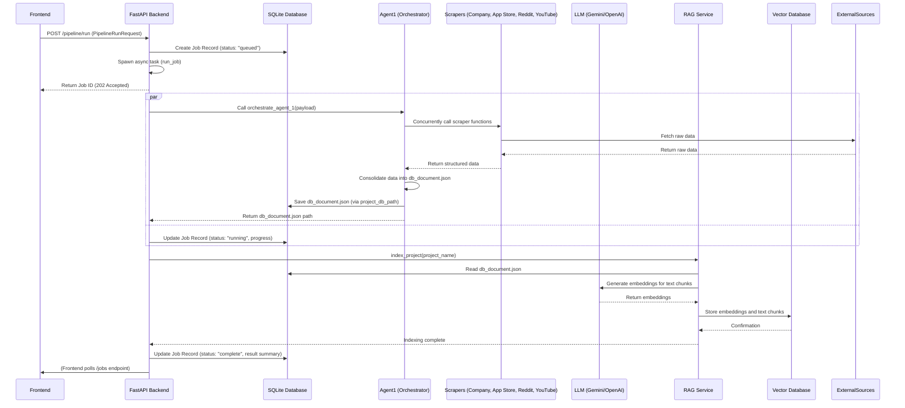
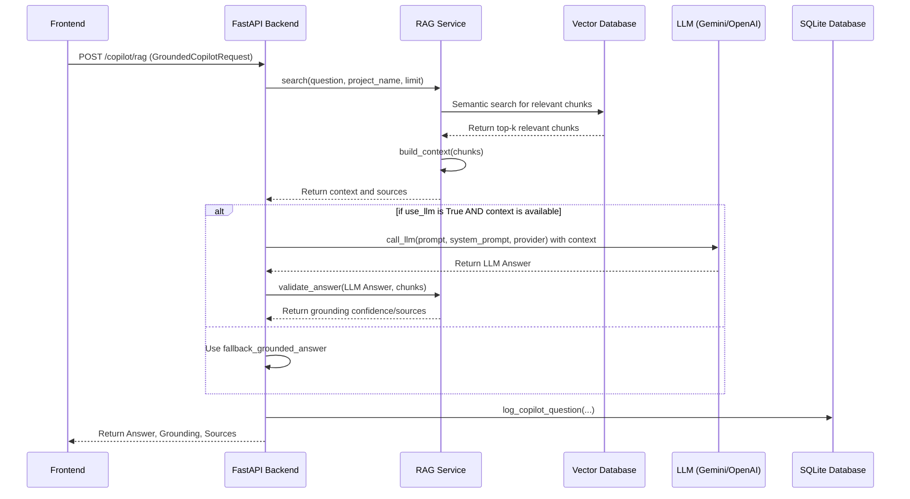

# Insights Platform Architecture Document

## 1. Introduction

This document provides a comprehensive overview of the Insights Platform's architecture, detailing its core components, their responsibilities, interconnections, and data flow. The platform is designed to gather, process, and analyze information from various sources (web scraping, internal documents) to generate actionable insights, supported by AI agents and a user-friendly web interface.

## 2. Overall System Architecture

The Insights Platform follows a modular, service-oriented architecture, primarily built with FastAPI for the backend and a vanilla JavaScript/HTML/CSS frontend. It leverages Python for data processing, AI agents, and scraping tasks.

**Conceptual Diagram (High-Level Block Diagram):**

```mermaid
graph TD
    UserInterface[Web Browser (index.html)] -->|HTTP/REST| FastAPIBackend
    FastAPIBackend -->|Calls| Agents
    FastAPIBackend -->|Calls| Scrapers
    FastAPIBackend -->|Reads/Writes| Database[SQLite (insights.db)]
    FastAPIBackend -->|Interacts with| RAGService[Local RAG Service]
    Agents -->|Uses| Scrapers
    Agents -->|Uses| LLMConnect[LLM Connection (Gemini/OpenAI/Claude)]
    Agents -->|Reads/Writes| Database
    Scrapers -->|Fetches Data from| ExternalSources[External Web/APIs]
    RAGService -->|Indexes/Searches| VectorStore[Vector Database (Supabase/Local)]
    RAGService -->|Reads| ProjectData[Project Data (db_document.json)]
```

**Key Architectural Principles:**
*   **Modularity:** Components are designed to be independent and loosely coupled.
*   **Asynchronous Processing:** Long-running tasks (scraping, agent pipelines) are handled asynchronously via job queues.
*   **Data-Centric:** Data persistence and retrieval are central, with clear schemas and storage mechanisms.
*   **Extensibility:** New scrapers, agents, or data sources can be integrated with minimal impact.

## 3. Core Components

### 3.1. Frontend (backend/static/index.html)

The user interface is a single-page application (SPA) built with HTML, CSS, and vanilla JavaScript. It communicates with the FastAPI backend via RESTful API calls.

**Key Responsibilities:**
*   Displaying project dashboards, history, and configuration.
*   Providing forms for initiating research pipelines and news monitors.
*   Rendering detailed project views with structured data.
*   Interacting with the Copilot for AI-powered Q&A.
*   Managing UI state (active page, theme, form defaults).

**Connections:**
*   **FastAPI Backend:** All data fetching and submission are done through `fetch` API calls to the backend endpoints.

### 3.2. FastAPI Backend (backend/app.py, backend/routes/, backend/services.py)

The backend is built using FastAPI, providing a robust and performant API layer.

**Key Responsibilities:**
*   **API Routing:** Defines and handles all API endpoints (`/projects`, `/pipeline`, `/copilot`, etc.).
*   **Request Validation:** Uses Pydantic models (defined in `backend/schemas.py`) to validate incoming request data.
*   **Business Logic Orchestration:** Coordinates calls to various services (agents, scrapers, database, RAG).
*   **Job Management:** Queues and manages asynchronous tasks.
*   **Configuration Management:** Stores and retrieves application settings.
*   **Static File Serving:** Serves the `index.html` and other static assets.

**Connections:**
*   **Frontend:** Serves the UI and responds to API requests.
*   **Agents:** Invokes agent functions for complex processing.
*   **Scrapers:** Triggers data collection.
*   **Database:** Interacts with `core/database.py` for data persistence.
*   **RAG Service:** Uses `core/rag_service.py` for retrieval-augmented generation.
*   **LLM Connection:** Utilizes `agents/model_connect.py` for LLM interactions.

### 3.3. AI Agents (agents/)

The `agents/` directory contains the core intelligence of the platform, responsible for orchestrating data collection, processing, and insight generation.

**Key Responsibilities:**
*   **Orchestration:** `agent1_orchestrator.py` manages the execution of various scrapers based on a given payload.
*   **Data Processing:** Subsequent agents (e.g., `agent2_insight.py`, `agent3_synthesis.py`, `agent4_brief.py`) perform analysis, summarization, and insight extraction.
*   **LLM Interaction:** Agents communicate with large language models for advanced tasks.

**Connections:**
*   **FastAPI Backend:** Called by the backend to initiate pipelines.
*   **Scrapers:** Directly invokes scraper functions.
*   **LLM Connection:** Uses `agents/model_connect.py`.
*   **Database:** Reads/writes project data and job status.

### 3.4. Scrapers (scrapers/)

The `scrapers/` directory houses individual modules for extracting data from specific external sources.

**Key Responsibilities:**
*   **Data Extraction:** Each scraper is specialized to fetch data from a particular platform (e.g., Play Store, App Store, Reddit, YouTube, Company Profile).
*   **Data Normalization:** Scrapers often clean and structure the raw data into a consistent format.
*   **Error Handling:** Includes mechanisms for retries and graceful failure.

**Connections:**
*   **Agents:** Primarily called by `agent1_orchestrator.py`.
*   **External Sources:** Makes HTTP requests to external websites or APIs.

### 3.5. Core Utilities (core/)

This directory contains fundamental services and utilities used across the application.

**Key Responsibilities:**
*   **Database Management:** `core/database.py` handles SQLite database initialization and CRUD operations for chat sessions, job records, and summaries.
*   **RAG Service:** `core/rag_service.py` manages the RAG pipeline, including indexing project data and performing semantic searches.
*   **Drive Configuration:** `core/drive_config.py` manages Google Drive API credentials and settings.

**Connections:**
*   **FastAPI Backend:** Directly used by backend routes and services.
*   **Agents:** Used by agents for data storage and retrieval.

## 4. Data Models and Schemas (backend/schemas.py)

The `backend/schemas.py` file defines Pydantic models that ensure data consistency and enable automatic request/response validation in FastAPI. These schemas represent the data contracts for API interactions and internal data structures.

**Key Schemas:**

*   **`PipelineRunRequest`**:
    *   **Purpose:** Defines the input structure for initiating a full research pipeline.
    *   **Fields:** `project_name` (str), `provider` (str, default "gemini"), `domain` (Optional[str]), `start_from` (str, e.g., "agent1"), `only` (Optional[str]), `agent1_payload` (Optional[Dict[str, Any]]).
    *   **Relationship:** Used by the `/pipeline/run` endpoint.

*   **`LocalTranscriptRequest`**:
    *   **Purpose:** Defines the input for ingesting local transcript files.
    *   **Fields:** `project_name` (str), `input_path` (str), `provider` (str), `domain` (Optional[str]), `run_async` (bool).
    *   **Relationship:** Used by the `/ingest/transcripts/local` endpoint.

*   **`GoogleDriveRequest`**:
    *   **Purpose:** Defines the input for ingesting documents from Google Drive.
    *   **Fields:** `project_name` (str), `folder_id` (str), `provider` (str), `domain` (Optional[str]), `credentials_path` (Optional[str]), `token_path` (Optional[str]), `include_existing` (bool), `run_async` (bool).
    *   **Relationship:** Used by the `/ingest/google-drive` endpoint.

*   **`CopilotRequest`**:
    *   **Purpose:** Defines the input for a standard Copilot chat interaction.
    *   **Fields:** `project_name` (str), `question` (str), `provider` (str), `history` (list[dict]).
    *   **Relationship:** Used by the `/copilot/chat` endpoint (hypothetical, based on common patterns).

*   **`NewsMonitorRequest`**:
    *   **Purpose:** Defines the structure for creating or updating a news monitoring query.
    *   **Fields:** `name` (str), `query` (str), `schedule_time` (str), `timezone` (str), `sources` (list[str]), `enabled` (bool).
    *   **Relationship:** Used by the `/news/monitors` endpoint.

*   **`ChatMessageRequest`**:
    *   **Purpose:** Represents a single chat message in a session.
    *   **Fields:** `session_id` (str), `content` (str), `role` (str).
    *   **Relationship:** Used for chat-related endpoints.

*   **`ChatSessionRequest`**:
    *   **Purpose:** Defines the input for creating a new chat session.
    *   **Fields:** `project_name` (str), `provider` (str), `domain` (Optional[str]), `run_async` (bool).
    *   **Relationship:** Used for chat session creation.

*   **`RAGIndexRequest`**:
    *   **Purpose:** Defines the input for triggering RAG indexing.
    *   **Fields:** `project_name` (Optional[str]).
    *   **Relationship:** Used by the `/rag/index` endpoint.

*   **`RAGSearchRequest`**:
    *   **Purpose:** Defines the input for performing a RAG search.
    *   **Fields:** `query` (str), `project_name` (Optional[str]), `limit` (int).
    *   **Relationship:** Used by the `/copilot/rag` endpoint.

*   **`GroundedCopilotRequest`**:
    *   **Purpose:** Defines the input for a RAG-grounded Copilot query.
    *   **Fields:** `question` (str), `project_name` (Optional[str]), `provider` (str), `limit` (int), `use_llm` (bool).
    *   **Relationship:** Used by the `/copilot/rag` endpoint.

*   **`AppConfigRequest`**:
    *   **Purpose:** Defines the structure for updating application-wide configurations.
    *   **Fields:** `values` (Dict[str, Any]).
    *   **Relationship:** Used by the `/config/app` endpoint.

## 5. Detailed Component Analysis and Interconnections

I will now proceed to analyze each major file and document its role and connections.

### 5.1. `backend/app.py`

*   **Purpose:** The main entry point for the FastAPI application. It initializes the FastAPI app, sets up middleware (CORS), includes all API routers, and defines the static file serving logic.
*   **Key Functions:**
    *   `lifespan(app: FastAPI)`: An asynchronous context manager that initializes core services (database, drive config, RAG service) when the app starts.
    *   `app.add_middleware(CORSMiddleware, ...)`: Configures Cross-Origin Resource Sharing.
    *   `app.include_router(...)`: Integrates API routes from `backend/routes/`.
    *   `app.mount("/assets", ...)`: Serves static assets.
    *   `frontend()`: Serves the `index.html` file for the root URL (`/`).
    *   `catch_all()`: A fallback route to serve `index.html` for client-side routing.
*   **Connections:**
    *   **`backend/routes/*`:** Imports and includes all API routers.
    *   **`core/database.py`:** Calls `get_db()` during lifespan.
    *   **`core/drive_config.py`:** Calls `get_drive_config()` during lifespan.
    *   **`core/rag_service.py`:** Calls `get_rag_service()` during lifespan.
    *   **`agents/paths.py`:** Imports `ensure_all_dirs()` to set up necessary directories.
    *   **`backend/static/index.html`:** Serves this file as the main frontend.

### 5.2. `backend/routes/projects.py`

*   **Purpose:** Defines API endpoints related to project management, including listing all projects and retrieving details for a specific project.
*   **Key Functions:**
    *   `health()`: A simple health check endpoint.
    *   `list_projects()`: Retrieves a summary of all available projects by scanning `DB_ROOT` for `db_document.json` files.
    *   `get_project(project_name: str)`: Fetches the complete `db_document.json` for a given project.
*   **Connections:**
    *   **`agents/paths.py`:** Uses `DB_ROOT` and `project_db_path()` to locate project data files.
    *   **`backend/services.py`:** Uses `read_json()` to parse project data.
    *   **Frontend:** Provides data for the dashboard and project view.

### 5.3. `backend/services.py`

*   **Purpose:** Contains core business logic for job management, data serialization, and RAG-related operations. It acts as an intermediary between API routes and deeper service layers.
*   **Key Functions:**
    *   `read_json()`, `write_json()`: Utility functions for JSON file I/O.
    *   `dump_model()`: Converts Pydantic models to dictionaries.
    *   `slug_id()`: Generates URL-friendly IDs.
    *   `create_job()`, `update_job()`: Manages the lifecycle of asynchronous jobs, persisting their state to `JOBS_PATH`.
    *   `run_job()`: Executes a given function asynchronously, updating job status and handling RAG indexing post-completion.
    *   `summarize_result()`: Extracts key information from agent results for job status display.
    *   `pipeline_payload()`: Prepares the payload for agent pipelines.
    *   `fallback_grounded_answer()`: Provides a default response for Copilot if LLM generation is skipped.
    *   `answer_with_rag()`: Orchestrates RAG search and LLM-based answer generation for Copilot queries.
*   **Connections:**
    *   **`agents/paths.py`:** Uses `STATE_ROOT` for `JOBS_PATH` and `NEWS_MONITORS_PATH`.
    *   **`backend/schemas.py`:** Uses `PipelineRunRequest`.
    *   **`core/rag_service.py`:** Calls `get_rag_service()` and its methods (`index_project`, `search`, `build_context`, `validate_answer`).
    *   **`agents/model_connect.py`:** Calls `call_llm()` for LLM interactions.
    *   **FastAPI Backend:** Used by various routes for job handling and RAG.

### 5.4. `core/database.py`

*   **Purpose:** Manages the SQLite database (`insights.db`) for persistent storage of application data, including chat sessions, messages, daily summaries, job records, and Copilot question logs.
*   **Key Data Classes (`@dataclass`):**
    *   `ChatMessage`, `ChatSession`, `DailySummary`, `JobRecord`, `CopilotQuestionLog`. These define the structure of data stored in the database.
*   **Key Methods (within `Database` class):**
    *   `_init_db()`: Creates all necessary tables if they don't exist.
    *   `create_session()`, `get_session()`, `list_project_sessions()`: Manage chat sessions.
    *   `add_message()`, `get_session_messages()`: Manage chat messages within sessions.
    *   `save_summary()`, `get_summary()`, `get_latest_summary()`: Manage daily summaries.
    *   `create_job()`, `update_job()`, `get_job()`: Manage job records.
    *   `log_copilot_question()`, `list_copilot_questions()`: Log Copilot interactions.
*   **Connections:**
    *   **`agents/paths.py`:** Uses `DB_FILE` and `ensure_all_dirs()`.
    *   **FastAPI Backend/Services:** Provides the `get_db()` singleton instance for database access.

### 5.5. `core/rag_service.py`

*   **Purpose:** Implements the Retrieval Augmented Generation (RAG) service, which is responsible for indexing project data into a vector store and retrieving relevant information to ground LLM responses.
*   **Key Functions:**
    *   `index_project(project_name: str)`: Processes `db_document.json` and associated raw files for a project, extracts text, chunks it, generates embeddings, and stores them in the vector database.
    *   `search(query: str, project_name: Optional[str], limit: int)`: Performs a semantic search against the vector store to find relevant text chunks.
    *   `build_context(chunks: List[Chunk])`: Assembles retrieved chunks into a coherent context string for the LLM.
    *   `validate_answer(answer: str, chunks: List[Chunk])`: Evaluates the LLM's answer against the retrieved context for grounding and confidence.
*   **Connections:**
    *   **FastAPI Backend/Services:** Provides the `get_rag_service()` singleton instance.
    *   **`agents/paths.py`:** Uses `project_db_path()` and `project_dir()` to access project files.
    *   **Vector Database:** Interacts with a vector database (e.g., Supabase pgvector or a local equivalent).
    *   **LLM Connection:** Uses LLMs for embedding generation and potentially for answer validation.

### 5.6. `agents/paths.py`

*   **Purpose:** Centralizes all important file system paths used throughout the project, ensuring consistency and easy configuration.
*   **Key Variables:**
    *   `PROJECT_ROOT`, `AGENTS_ROOT`, `DB_ROOT`, `STATE_ROOT`, `DATA_ROOT`, `TRANSCRIPT_ROOT`.
    *   `SESSIONS_ROOT`, `SUMMARIES_ROOT`, `VECTORS_ROOT`, `DB_FILE`.
    *   `CONFIG_FILE`, `DRIVE_CONFIG_FILE`.
*   **Key Functions:**
    *   `project_db_path(project_name: str)`: Returns the path to a project's main `db_document.json`.
    *   `project_dir(project_name: str)`: Returns the root directory for a project's data.
    *   `ensure_all_dirs()`: Creates all necessary base directories if they don't exist.
*   **Connections:**
    *   **Almost all other modules:** Imported and used extensively for file system operations.

### 5.7. `agents/model_connect.py`

*   **Purpose:** Provides a unified interface for interacting with various Large Language Models (LLMs), abstracting away provider-specific API calls.
*   **Key Functions:**
    *   `call_llm(...)`: A generic function to send prompts to an LLM (e.g., Gemini, OpenAI, Claude) and receive responses. Handles different providers and configurations.
*   **Connections:**
    *   **AI Agents:** Used by all agents that require LLM capabilities.
    *   **`core/rag_service.py`:** May use this for embedding generation or answer validation.

### 5.8. `agents/agent1_orchestrator.py`

*   **Purpose:** The first agent in the pipeline, responsible for gathering raw data from various sources by invoking different scrapers concurrently. It consolidates the scraped data into a `db_document.json` for the project.
*   **Key Functions:**
    *   `orchestrate_agent_1(payload: Dict[str, Any])`: The main orchestration logic. It parses the payload, identifies which scrapers to run, executes them in parallel, and merges their outputs.
    *   `run_scraper_safe()`: A wrapper to execute scraper functions safely and asynchronously, catching errors.
    *   `_build_reddit_tasks()`, `_build_youtube_tasks()`: Helper functions to prepare tasks for Reddit and YouTube scrapers based on configuration.
    *   `_consolidate_scraper_files()`: Moves raw scraper outputs into a centralized `raw/` directory.
*   **Connections:**
    *   **FastAPI Backend:** Called by the pipeline endpoint.
    *   **`scrapers/*`:** Imports and calls specific scraper functions (e.g., `scrapers.company_profile.run_research_task`, `scrapers.play_store.play_store`).
    *   **`agents/paths.py`:** Uses `DB_ROOT` for project data storage.
    *   **`backend/services.py`:** Its output is processed by `summarize_result` and indexed by RAG.

### 5.9. `scrapers/company_profile.py`

*   **Purpose:** Scrapes comprehensive company information using LLMs with Google Search grounding. It performs a two-phase research process to gather core facts and then deep analysis.
*   **Key Functions:**
    *   `GeminiCompanyResearcher` class: Encapsulates the research logic, including API key management, prompt building, LLM calls, and JSON parsing/repair.
    *   `_build_prompt_phase_a()`, `_build_prompt_phase_b()`: Constructs detailed prompts for LLMs based on the desired output schema.
    *   `_call_primary()`, `_call_structured()`: Handles LLM API calls with different models and JSON output modes.
    *   `_extract_json()`, `_fix_json()`: Robustly extracts and repairs JSON from LLM text responses.
    *   `_repair_with_ai()`: A secondary LLM pass to fix malformed JSON outputs.
    *   `perform_research()`: Orchestrates the two-phase research process.
    *   `save_results()`: Saves the final structured company profile to a JSON file.
    *   `run_research_task()`: The public interface for external callers.
*   **Connections:**
    *   **`agents/model_connect.py`:** Implicitly uses LLM connection (though it directly uses `google.genai` client).
    *   **`agent1_orchestrator.py`:** Called by the orchestrator.
    *   **External APIs:** Makes calls to Google Gemini API with Google Search grounding.

### 5.10. `scrapers/play_store.py` and `scrapers/app_store.py`

*   **Purpose:** These modules are responsible for scraping app details and user reviews from Google Play Store and Apple App Store, respectively. They provide granular control over the number of reviews fetched per rating.
*   **Key Functions (similar across both):**
    *   `PlayStoreAPIClient` / `AppStoreAPIClient` classes: Handle API interactions (e.g., `google-play-scraper`, iTunes API).
    *   `search()`: Finds apps based on a query.
    *   `get_app_details()`: Fetches metadata for a specific app.
    *   `get_reviews_by_rating()`: Collects user reviews, distributing the fetch count across different star ratings.
    *   `analyze_reviews()`: Provides basic statistical analysis of the collected reviews.
    *   `analyze_extracted_data()`: Integrates with `scrapers/analyzer.py` for deeper AI-powered analysis of the reviews.
    *   `play_store()` / `app_store()`: The main entry point functions.
*   **Connections:**
    *   **`agent1_orchestrator.py`:** Called by the orchestrator.
    *   **`scrapers/analyzer.py`:** Imports and uses the analyzer for review sentiment/topic analysis.
    *   **External APIs:** Interacts with Google Play Store and iTunes APIs.

### 5.11. `scrapers/reddit.py`

*   **Purpose:** A unified scraper for Reddit, capable of extracting data from subreddits, user profiles, search results, and individual posts, including nested comments.
*   **Key Functions:**
    *   `RedditScraper` class: Manages HTTP sessions, rate limiting, and core scraping logic.
    *   `_detect_input_type()`: Automatically determines if the input is a subreddit, user, search query, or post URL.
    *   `_fetch_json()`: Handles fetching JSON data from Reddit's API endpoints.
    *   `_extract_post_data()`, `_extract_comment_data()`: Parses raw JSON into structured dictionaries.
    *   `_fetch_comments_recursive()`: Recursively fetches nested comments.
    *   `scrape_post()`, `scrape_subreddit()`, `search_reddit()`, `scrape_user()`: Implement the specific scraping modes.
    *   `reddit()`: The main entry point function.
*   **Connections:**
    *   **`agent1_orchestrator.py`:** Called by the orchestrator.
    *   **External API:** Interacts with `www.reddit.com/.json` endpoints.

### 5.12. `scrapers/youtube.py`

*   **Purpose:** Scrapes YouTube video transcripts and metadata (title, description) from single videos, channels, or search results.
*   **Key Functions:**
    *   `_video_id_from_url()`: Extracts video IDs from various YouTube URL formats.
    *   `_transcript_via_library()`: Fetches transcripts using `youtube-transcript-api` with fallback logic (English, translated, native).
    *   `_get_video_metadata_ytdlp()`, `_get_video_metadata_html()`: Retrieves video metadata using `yt-dlp` (subprocess call) or by scraping HTML as a fallback.
    *   `get_transcript()`, `get_video_info()`: Public helpers for transcript and metadata.
    *   `scrape_single_video()`: Combines metadata and transcript fetching for one video.
    *   `_get_channel_video_ids()`, `_search_youtube()`: Uses `yt-dlp` to list video IDs from channels or search results.
    *   `mode_video()`, `mode_channel()`, `mode_search()`: Implement the specific scraping modes.
    *   `youtube_scraper()`: The main entry point function.
*   **Connections:**
    *   **`agent1_orchestrator.py`:** Called by the orchestrator.
    *   **External Libraries/Tools:** Relies on `youtube-transcript-api` and `yt-dlp` (via subprocess).
    *   **External API:** Interacts with YouTube.

### 5.13. `scrapers/analyzer.py`

*   **Purpose:** (Assumed, based on `play_store.py` and `app_store.py` usage) Provides AI-powered analysis of scraped data, particularly reviews, to extract sentiment, topics, or other insights.
*   **Key Functions:**
    *   `analyzer(data: Dict, mode: str, platform: str)`: A function that takes extracted data (e.g., app reviews), a mode (e.g., "detailed"), and the platform, and returns an analysis.
*   **Connections:**
    *   **`scrapers/play_store.py`**, **`scrapers/app_store.py`**: Imports and uses this module.
    *   **`agents/model_connect.py`:** Likely uses LLMs for the actual analysis.

## 6. Data Flow and Relationships

### 6.1. Research Pipeline Execution

**Conceptual Diagram (Sequence Diagram):**



### 6.2. Copilot Interaction

**Conceptual Diagram (Sequence Diagram):**



## 7. File System Structure (agents/paths.py)

The `agents/paths.py` module defines the canonical locations for various data and configuration files.

```
.
├── ARCHITECTURE.md
├── backend/
│   ├── app.py
│   ├── routes/
│   │   ├── chat.py
│   │   ├── config.py
│   │   ├── copilot.py
│   │   ├── jobs.py
│   │   ├── news.py
│   │   ├── projects.py
│   │   ├── rag.py
│   │   ├── research.py
│   │   └── summaries.py
│   ├── schemas.py
│   ├── services.py
│   └── static/
│       ├── index.html
│       └── dummy_project.json (for development/testing)
├── agents/
│   ├── agent1_orchestrator.py
│   ├── agent2_insight.py
│   ├── agent3_synthesis.py
│   ├── agent4_brief.py
│   ├── agent5_copilot.py
│   ├── model_connect.py
│   └── paths.py
├── core/
│   ├── database.py
│   ├── drive_config.py
│   └── rag_service.py
├── data/
│   ├── insights.db (SQLite database)
│   ├── sessions/
│   ├── state/
│   │   ├── config.json
│   │   ├── drive_config.json
│   │   └── jobs.json
│   └── summaries/
├── database_mock/
│   └── {project_name}/
│       ├── db_document.json
│       └── raw/
│           └── ... (raw scraper outputs)
├── scrapers/
│   ├── analyzer.py
│   ├── app_store.py
│   ├── company_profile.py
│   ├── google_drive.py
│   ├── internal.py
│   ├── play_store.py
│   ├── reddit.py
│   └── youtube.py
└── transcript_input/
```

## 8. Deployment and Execution

The backend is a FastAPI application, typically run with Uvicorn (e.g., `uvicorn app:app --reload`). The frontend is served directly by FastAPI as static files. Asynchronous tasks are managed internally by Python's `asyncio` and `asyncio.to_thread` for blocking I/O operations.

## 9. Future Considerations and Improvements

*   **Scalability:** For high-volume scraping or complex agent pipelines, consider distributed task queues (e.g., Celery with Redis/RabbitMQ).
*   **Vector Database:** Evaluate managed vector database services (e.g., Pinecone, Weaviate, Qdrant) for production RAG deployments.
*   **Authentication/Authorization:** Implement user management and access control for multi-user environments.
*   **Observability:** Enhance logging, monitoring, and tracing for better operational insights.
*   **Frontend Framework:** Consider a modern JavaScript framework (React, Vue, Svelte) for more complex UI interactions and state management.
*   **Agent Orchestration:** Explore more advanced agent frameworks (e.g., LangChain, CrewAI) for complex multi-agent workflows.

---

This `ARCHITECTURE.md` provides a detailed understanding of the Insights Platform. I will now proceed with the frontend redesign in `index.html` based on the principles outlined here, ensuring it aligns with this architectural vision.